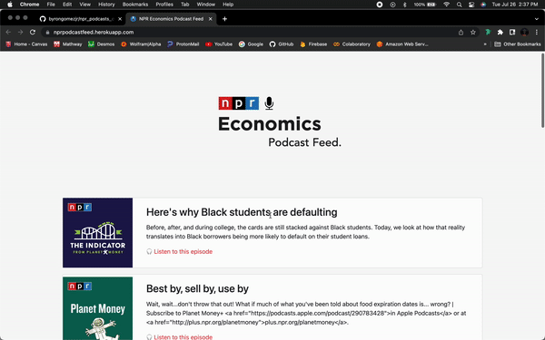

# Content Aggregator Using Django - NPR Podcasts

I'm a big fan of economics as a whole, so I decided to make a content aggregator application using Python's extensive Django framework.

I used RSS Feed from my favorite NPR podcasts, https://www.npr.org/podcasts-and-shows/

& deployment was made using Railway.

You can find the live version of this project here -->> https://web-production-9b11.up.railway.app/ ✌🏼

---

